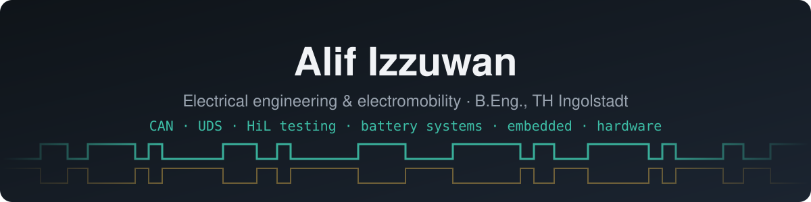

I build the tools I wish test benches came with. My B.Eng. in electrical engineering and electromobility at
TH Ingolstadt ended with a thesis that reads a VW ID. Buzz's battery through the OBD-II gateway, and an internship
on a hardware-in-the-loop test team showed me how much time engineers lose to missing tooling. Most of what is
below comes from one of those two places: **vehicle networks, battery systems, and the software and hardware
that test them.**

### Automotive diagnostics & testing

<table>
<tr>
<td width="50%" valign="top">

<b><a href="https://github.com/Alifizz01/CANedge2-UDS-implementation-Thesis">VW ID. Buzz battery over UDS</a></b> · bachelor thesis 
The MEB gateway hides the BMS from the OBD-II port, so a CANedge2 logger <i>asks</i> instead of listens. 60 identifiers tested,
three encodings the public list gets wrong, and a desktop app for logger profiles and MF4 decoding. 
<code>CAN</code> <code>UDS</code> <code>Python</code> <code>LaTeX</code>
</td>
<td width="50%" valign="top">

<b><a href="https://github.com/Alifizz01/XiLoop">XiLoop</a></b> · X-in-the-loop test bench 
One test plan from a Python prototype to C firmware to a real board: SiL, PiL and HiL with the same
requirements, a desktop studio and a REST API. 
<code>Python</code> <code>C</code> <code>control</code> <code>HiL</code>
</td>
</tr>
<tr>
<td valign="top">

<b><a href="https://github.com/Alifizz01/BusBench">BusBench</a></b> · protocol workbench 
Ten automotive and avionics protocols (CAN, UDS/ISO-TP, AUTOSAR, DoIP, ARINC 429, MIL-STD-1553 …) implemented
twice, in C and in Python, and tested against each other. Fuzzed in CI. 
<code>C</code> <code>Python</code> <code>libFuzzer</code>
</td>
<td valign="top">

<b><a href="https://github.com/Alifizz01/ToolBridge">ToolBridge</a></b> · APIs for GUI-only tools 
Reads a Windows engineering tool (an ECU flasher, a calibration program) through UI Automation and .NET
metadata and generates a Python package and REST API for it. No pixel clicking. 
<code>Python</code> <code>UI Automation</code> <code>.NET</code>
</td>
</tr>
<tr>
<td valign="top">

<b><a href="https://github.com/Alifizz01/BenchPulse">BenchPulse</a></b> · HiL lab dashboard 
Which bench PC is free, who is on the busy ones over Remote Desktop, and when you can book it.
One browser page for the whole lab, no install for colleagues. 
<code>Python</code> <code>Windows API</code> <code>SQLite</code>
</td>
<td valign="top">

<b><a href="https://github.com/Alifizz01/PiLink">PiLink</a></b> · verified PC ↔ USB transfer box 
A Raspberry Pi between a locked-down PC and a USB stick: the PC only speaks FTP, every copy is
checksum-verified before it says "done". 
<code>Python</code> <code>Raspberry Pi</code>
</td>
</tr>
</table>

### Battery & powertrain

<table>
<tr>
<td width="50%" valign="top">

<b><a href="https://github.com/Alifizz01/GAIA">GAIA</a></b> · BMS simulator 
PyBaMM electrochemistry for the cells and a real BMS on top: SOC estimation, protection, balancing,
contactors. Fault injection, a desktop studio and Simulink blocks. 
<code>Python</code> <code>PyBaMM</code> <code>MATLAB/Simulink</code>
</td>
<td width="50%" valign="top">

<b><a href="https://github.com/Alifizz01/AETHER">AETHER</a></b> · electric propulsion 
GAIA's sibling for what the battery drives: give it a throttle and get the whole chain, from where the
shaft settles to where every watt went. 
<code>Python</code> <code>modelling</code>
</td>
</tr>
</table>

### Hardware

<table>
<tr>
<td width="50%" valign="top">

<b><a href="https://github.com/Alifizz01/fpga-can-timestamper">CAN-FD hardware timestamper</a></b> · FPGA 
A two-channel CAN-FD receiver in VHDL that timestamps every frame in hardware on one shared clock. Open
toolchain rebuilt in CI, with a <a href="https://alifizz01.github.io/fpga-can-timestamper/">live capture viewer</a>. 
<code>VHDL</code> <code>Lattice ECP5</code> <code>CAN-FD</code>
</td>
<td width="50%" valign="top">

<b><a href="https://github.com/Alifizz01/automotive-pcb-portfolio">Automotive PCB portfolio</a></b> · Altium 
Three CAN-FD tools taken end to end: requirements, schematic, layout, fab outputs. A sniffer HAT for the Pi
Zero 2 W, a handheld OBD-II test runner, and an isolated FPGA timestamper board. 
<code>Altium Designer</code> <code>CAN-FD</code> <code>Raspberry Pi</code>
</td>
</tr>
</table>

### Desktop

<table>
<tr>
<td width="50%" valign="top">

<b><a href="https://github.com/Alifizz01/Floatie">Floatie</a></b> · desktop fences for Windows 
Live, filtered views of your Desktop and Downloads that stay where you put them, plus a Tidy with preview and
undo. About 10 MB of RAM idle. 
<code>C#</code> <code>WPF</code> <code>Win32</code>
</td>
</tr>
</table>

### Toolbox

